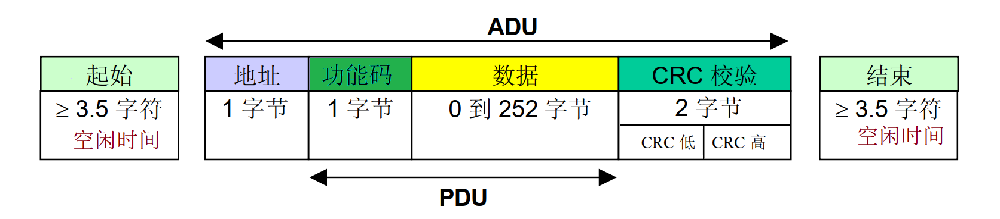
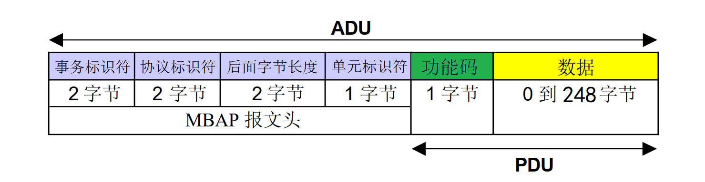

# Modbus 协议

Modbus 是工业界常用的一种简单、可靠、开放的通信协议，可以在多种通信媒介上实施，包括常见的 RS232、RS485 和以太网。

## Modbus RTU

Modbus RTU 是 Modbus 最常见的实现方式，它基于串行通信总线（例如 RS232、RS485），并采用紧凑的二进制数据形式进行协议通信。RTU 格式在命令/数据之后带有循环冗余校验的校验和作为错误校验机制，以确保数据的可靠性。

## Modbus TCP

Modbus TCP（或称为 Modbus TCP/IP）是一种 Modbus 变体，用于通过 TCP/IP 网络进行通信，默认通过端口 502 进行连接。和前面两种不一样，Modbus TCP 不需要校验和计算，因为较低层的 TCP/IP 协议栈已经提供校验和保护。

